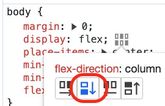

# 02 Portales

## Resumen

Vamos a cubrir un concepto interesante de _React_, los Portales. Los Portales nos permiten renderizar un componente en un nodo del DOM que no es hijo del nodo donde se renderiza el componente padre. Estos fueron introducidos en _React 16_.

¿Por qué quiero esto? Bueno, si tenemos un componente que renderiza un modal, y queremos que el modal se muestre en el DOM raíz, y no en el DOM del componente padre, podemos usar un portal, más usos, _hover_, _tooltips_ etc...

Oye pero si esto ya lo puedo hacer yo con el _z-index_... Ehh ummm claro, _z-index_ 9999, ¿O era? 999999, o 99999999 :)

Vamos a ver cómo funciona esto paso a paso, partiremos de un ejemplo muy simple e iremos
añadiéndole funcionalidad encima hasta tener un component de diálogo modal.

## Paso a Paso

- Este ejemplo toma como punto de partida el ejemplo _00-boiler-plate_.

- Primero copiamos el ejemplo anterior, y hacemos un _npm install_

```bash
npm install
```

Para crear un _component_ fuera del sitio donde se renderiza el componente padre (es decir fuera de su orden natural), _React Dom_ expone una función llamada _createPortal_, esta función acepta dos parámetros:

- El componente que queremos renderizar.
- El nodo del _DOM_ donde queremos renderizar el componente.

Vamos a partir de un ejemplo muy simple, en el _HTML_ vamos añadir un _Div_ que será
el último elemento del _body_ (lo identificaremos con el id _lastnode_):

_./index.html_

```diff
  <body>
    <div id="root"></div>
+    <div id="lastnode"></div>
  </body>
```

Ya tenemos el nodo HTML, para que nuestro código quede más limpio, vamos a crearnos un _wrapper_ que hará uso de _createPortal_ (este componente lo haremos crecer más adelante).

Aceptamos como _props_:

- **_Children_**: el estándar de _React_.
- **_wrapperId_**: el _id_ del nodo donde queremos renderizar el componente.

Y el componente devuelve un componente que se instancia en el nodo del _DOM_ que cuyo _id_ le hemos pasado como parámetro.

_./src/common/components/react-portal.component.tsx_

```tsx
import ReactDOM from "react-dom";

interface Props {
  children: React.ReactNode;
  wrapperId: string;
}

export const ReactPortalComponent: React.FC<Props> = (props) => {
  const { children, wrapperId } = props;

  return ReactDOM.createPortal(children, document.getElementById(wrapperId)!);
};
```

Ojo a la exclamación aquí, le estamos diciendo a modo estricto que ignore si esto puede ser null (por seguridad podríamos lanzar una excepción si eso paso o añadir código defensivo)

¿Si quitamos la exclamación que pasa?

Que da un error, esto puede ser nulo y no le gusta, Podríamos intentar el siguiente refactor:

```diff
export const ReactPortalComponent: React.FC<Props> = (props) => {
  const { children, wrapperId } = props;

+  const fallbackContainer = document.createDocumentFragment();
+
-  return ReactDOM.createPortal(children, document.getElementById(wrapperId)!);
+  return ReactDOM.createPortal(
+    children,
+    document.getElementById(wrapperId) ? (
+      document.getElementById(wrapperId)
+    ) : (
+      fallbackContainer
+    )
+  );
};
```

Pero esto da un error, _oye que el elemento puede seguir siendo nulo !!_ ¿Por qué? ¿Quien me lo dice?

> Solución: ¿Quien te dice que la llamada al _getElementById_ de unos milisegundos de antes va a dar el mismo resultado que la que llamo justo después?

¿Qué tenemos que hacer? guardar el resultado de getElementById en una variable y usar esa variable.

```diff
export const ReactPortalComponent: React.FC<Props> = (props) => {
  const { children, wrapperId } = props;

-  return ReactDOM.createPortal(
-    children,
-    document.getElementById(wrapperId) ? (
-      document.getElementById(wrapperId)
-    ) : (
-      <h1>React Portal Component Error missing: {wrapperId}</h1>
-    )
-  );
+
+ const element = document.getElementById(wrapperId);
+ const fallbackContainer = document.createDocumentFragment();
+
+  return ReactDOM.createPortal(
+    children,
+    element ? element : fallbackContainer
+  );
};
```

Este código es muy limpio, pero es de los que _si fallo, no aviso_ vamos a darle una ultima vuelta de tuerca... esta situación no es normal porque no pegar un buen castañazo y simplificar el código... sin miedo:

```diff
export const ReactPortalComponent: React.FC<Props> = (props) => {
  const { children, wrapperId } = props;

  const element = document.getElementById(wrapperId);
+ if (!element) throw new Error(`Portal component missing element with id: ${wrapperId}, check your index.html`);
-  const fallbackContainer = document.createDocumentFragment();

-  return ReactDOM.createPortal(children, element ? element : fallbackContainer);
+ return ReactDOM.createPortal(children, element);
};
```

_¿Y que pasa con el usuario final? ¿No está feo que se le muestre un error?_ De momento lo dejamos así, y cuando completemos el ejemplo nos metemos a añadirle un _ErrorBoundary_-

Vamos ahora a _app.tsx_, vamos a renderizar el siguiente contenido:

_./src/app.tsx_

```diff
import React from "react";

export const App = () => {
  return (
    <div>
      <h1> Hello React !!</h1>
+      <h3>I want to be at the end</h3>
+      <h2> Sub title</h2>
    </div>
  );
};
```

Si ejecutamos esto, podemos ver (cómo es de esperar) que el _h3_ se renderiza antes
que el _h2_,

> Abre el inspector y comprueba que esto es así en el HTML generado.

¿Y si pudiéramos decirle a _React_ que lo renderizara en el nodo del DOM _lastnode_?

_./src/app.tsx_

```diff
import React from "react";
+ import { ReactPortalComponent } from "./common/components/react-portal.component";

export const App = () => {
  return (
    <div>
      <h1> Hello React !!</h1>
+      <ReactPortalComponent wrapperId="lastnode">
        <h3>I want to be at the end</h3>
+      </ReactPortalComponent>
      <h2> Sub title</h2>
    </div>
  );
};
```

Si ahora ejecutamos esto podemos ver que el h3 aparece al final del todo, y si abrimos el inspector podemos ver que este componente cae debajo del node _lastnode_ que habíamos
definido.

> Abrir inspector y ver que el h3 está debajo del nodo lastnode.

Bueno no aparece al final porque el body es un contenedor flex, vamos a aprovechar para er las DevTools


Y allí en display flex, pinchamos en la pastilla de flex y cambiamos el flex-direction a column:



¿Para qué nos puede servir esto? fíjate que si renderizo en el último _div_ de un _body_ querrá decir que va a estar por encima de todo (no me haría falta tirar de _z-index_ salvo que alguna librería o código _legacy_ lo esté usando), es más podría hasta implementar de forma determinista el patrón malvado de _UI_ de un modal sobre un modal.

Antes de seguir implementando el _modal_ vamos a darle un poco de cariño a la función _helper_ que hemos creado (_ReactPortalComponent_), lo primero eso de tener un _div_ a fuego en el _HTML_ para el último nodo no suena a algo muy mantenible, ¿Y si no hiciera falta ponerlo? Podíamos comprobar si existe, en ese caso tiramos de él, y si no lo creamos al vuelo, además así evitamos un castañazo bíblico si este _tag_ no existe en el _HTML_.

Vamos a crear una función de ayuda para crear elementos de forma dinámica:

_./src/common/components/react-portal.component.tsx_

```diff
+ function createWrapperAndAppendToBody(wrapperId : string) {
+  const wrapperElement = document.createElement('div');
+  wrapperElement.setAttribute("id", wrapperId);
+  document.body.appendChild(wrapperElement);
+  return wrapperElement;
+ }

interface Props {
```

Y ahora vamos a darle uso en nuestro _ReactPortalComponent_:

- Primero comprobamos si existe el nodo del _DOM_.
- Si existe tiramos, pero si no lo creamos usando el _helper_.

_./src/common/components/react-portal.component.tsx_

```diff
export const ReactPortalComponent: React.FC<Props> = (props) => {
  const { children, wrapperId } = props;

-  const element = document.getElementById(wrapperId);
+  let element = document.getElementById(wrapperId);

-  if (!element)
-    throw new Error(
-      `Portal component missing element with id: ${wrapperId}, check your index.html`
-    );
-
+  if (!element) {
+    element = createWrapperAndAppendToBody(wrapperId);
+  }

  return createPortal(children, document.getElementById(wrapperId));
};
```

Pero que pasa que si lo creamos al vuelo, lo suyo es eliminarlo cuando ya no esté en uso el componente (no queremos ir dejando basura especial), aquí vamos a aprovecharnos de la función _useEffect_ que nos ofrece React, ¿Podemos usar un _effect_ dentro de esta función? La respuesta es sí, ya que esto se invoca dentro de un componente de _React_, y por tanto podemos usar los _hooks_.

En este caso como vamos a manipular directamente el _DOM_, y queremos que el código se ejecute de forma síncrona antes de que el DOM se repinte, así que en vez de _useEffect_ vamos a usar _useLayoutEffect_, que vamos a hacer:

- Crear un estado para guardar una referencia al nodo del DOM (en caso de que se cree de forma dinámica)
- En el _useLayoutEffect_, comprobamos si el nodo existe, en caso de que no creamos el nodo y lo guardamos en el estado, después en el destructuro del _useEffectLayout_ lo eliminamos.

_./src/common/components/react-portal.component.tsx_

```diff
+ import React from "react";
import ReactDOM from "react-dom";
....
export const ReactPortalComponent: React.FC<Props> = (props) => {
+  const [wrapperElement, setWrapperElement] = React.useState(null);
  const { children, wrapperId } = props;

+ React.useLayoutEffect(() => {
  let element = document.getElementById(wrapperId);
+  let createdOnTheFly = false;

  if (!element) {
    element = createWrapperAndAppendToBody(wrapperId);
+    createdOnTheFly = true;
  }
+   setWrapperElement(element);

+    return () => {
+      // Si lo hemos creado de forma dinámica lo borramos cuando toque
+      if (createdOnTheFly && element?.parentNode) {
+        element.parentNode.removeChild(element);
+      }
+    }
+ }, [wrapperId])

+  // Ojo en el primer render wrapperElement va a ser nulo, saltamos ese caso
+    if (wrapperElement === null) return null;

  return createPortal(children, document.getElementById(wrapperId));
};
```

Ahora podemos eliminar el _div_ del _HTML_ y el código sigue funcionando.

> IMPORTANTE DEPURAR ESTE CODIGO, y ver cómo funciona, que pasraría si pusieramos el wrapper
> en vez del wrapperId?

_./src/index.html_

```diff
  <body>
    <div id="root"></div>
-    <div id="lastnode"></div>
  </body>
```

- Bueno, hasta aquí hemos hecho una alarde que "bonito es esto pero para que sirve", vamos a implementar
  un diálogo modal.

Para ello creamos un nuevo componente, va a aceptar tres propiedades:

- **_isOpen_**: _flag_ para saber si está abierto o cerrado el modal.
- **_handleClose_**: función que se ejecuta cuando se cierra el modal.
- **_children_**: contenido del modal.

Vamos a definir algo de estilado:

- Para clase modal no pondremos _z-index_ (más adelante se lo añadiremos ya que nos podemos
  encontrar algún control que si lo use y nos juegue una mala pasada)

_./src/common/components/modal/modal.module.css_

```css
.modal {
  position: fixed;
  inset: 0; /* inset sets all 4 values (top right bottom left) much like how we set padding, margin etc., */
  background-color: rgba(0, 0, 0, 0.6);
  display: flex;
  flex-direction: column;
  align-items: center;
  justify-content: center;
  transition: all 0.3s ease-in-out;
  overflow: hidden;
  padding: 40px 20px 20px;
}

.modal-content {
  width: 70%;
  height: 70%;
  background-color: #282c34;
  color: #fff;
  display: flex;
  align-items: center;
  justify-content: center;
  font-size: 2rem;
}

.close-btn {
  padding: 1rem;
  border-radius: 0.25rem;
  border: none;
  font-weight: 600;
  margin-bottom: 1rem;
  -webkit-border-radius: 0.25rem;
  -moz-border-radius: 0.25rem;
  -ms-border-radius: 0.25rem;
  -o-border-radius: 0.25rem;
}
```

_./src/common/components/modal/modal.tsx_

```tsx
import React from "react";
import classes from "./modal.module.css";

interface Props {
  children: React.ReactNode;
  isOpen: boolean;
  handleClose: () => void;
}

export const Modal: React.FC<Props> = (props) => {
  const { children, isOpen, handleClose } = props;

  if (!isOpen) return null;

  return (
    <div className={classes.modal}>
      <button className={classes.closeBtn} onClick={handleClose}>
        Close
      </button>
      <div className={classes.modalContent}>{children}</div>
    </div>
  );
};
```

Vamos a crear un _barrel_:

_./src/common/components/modal/index.ts_

```ts
export * from "./modal";
```

Vamos a darle uso a este modal:

Primero vamos a importarlo:

_./src/app.tsx_

```diff
import React from "react";
import { ReactPortalComponent } from "./common/components/react-portal.component";
+ import {Modal} from './common/components/modal';
```

Ahora vamos a añadir el _flag_ de _isOpen_ y la función de _handleClose_ en nuestro app:

_./src/app.tsx_

```diff
export const App = () => {
+  const [isOpen, setIsOpen] = React.useState(false);
+  const handleOpen = () => setIsOpen(true);
+  const handleClose = () => setIsOpen(false);

  return (
    <div>
```

Y ya vamos a darle uso a nuestro modal, fíjate que lo ponemos dentro del portal para que se
renderice en el último nodo del DOM.

_./src/app.tsx_

```diff
+ import React from "react";

// (...)

  return (
    <div>
      <h1> Hello React !!</h1>
-      <ReactPortalComponent wrapperId="lastnode">
-        <h3>I want to be at the end</h3>
-      </ReactPortalComponent>
-      <h2> Sub title</h2>
+        <button onClick={handleOpen}>
+          Click to Open Modal
+        </button>
+        <ReactPortalComponent wrapperId="lastnode">
+          <Modal handleClose={handleClose} isOpen={isOpen}>
+           <div style={{ background: "white" }}>
+            This is Modal Content!
+          </div>
+          </Modal>
+        </ReactPortalComponent>
    </div>
  );
```

Lo probamos:

```bash
npm start
```

Y bien, vamos ahora a por el martillo fino.

Lo primero, si le vamos a añadir un _z-index_ elevado para evitar que algún componente de terceros que pueda usar este atributo muestre su componente por encima:

_./src/common/components/modal/modal.css_

```diff
.modal {
  position: fixed;
  inset: 0; /* inset sets all 4 values (top right bottom left) much like how we set padding, margin etc., */
  background-color: rgba(0, 0, 0, 0.6);
  display: flex;
  flex-direction: column;
  align-items: center;
  justify-content: center;
  transition: all 0.3s ease-in-out;
  overflow: hidden;
+  z-index: 999;
  padding: 40px 20px 20px;
}
```

Después, ¿Qué pasa si queremos cerrar el modal con el teclado? Es muy normal que un usuario quiera que esto se cierre pulsando ESC:

En este caso vamos a buscar una solución en el propio componente modal, en cuanto se cargue el componente y se asigne el _handler_ de cierre coloco un _event listener_ para escuchar el evento del teclado, y lo desmonto en cuanto se desmonte el componente:

_./src/common/components/modal/modal.tsx_

```diff
export const Modal: React.FC<Props> = (props) => {
  const { children, isOpen, handleClose } = props;

+  React.useEffect(() => {
+    const closeOnEscapeKey = (e: KeyboardEvent) => e.key === "Escape" ? handleClose() : null;
+    document.body.addEventListener("keydown", closeOnEscapeKey);
+    return () => {
+      document.body.removeEventListener("keydown", closeOnEscapeKey);
+    };
+  }, [handleClose])

  if (!isOpen) return null;

  return (
```

# Referencias

Este ejemplo se base en el material expuesto en este post https://blog.logrocket.com/build-modal-with-react-portals/

# ¿Te apuntas a nuestro máster?

Si te ha gustado este ejemplo y tienes ganas de aprender Front End
guiado por un grupo de profesionales ¿Por qué no te apuntas a
nuestro [Máster Front End Online Lemoncode](https://lemoncode.net/master-frontend#inicio-banner)? Tenemos tanto edición de convocatoria con clases en vivo, como edición continua con mentorización, para
que puedas ir a tu ritmo y aprender mucho.

También puedes apuntarte a nuestro Bootcamp de Back End [Bootcamp Backend](https://lemoncode.net/bootcamp-backend#inicio-banner)

Y si tienes ganas de meterte una zambullida en el mundo _devops_
apuntate nuestro [Bootcamp devops online Lemoncode](https://lemoncode.net/bootcamp-devops#bootcamp-devops/inicio)
